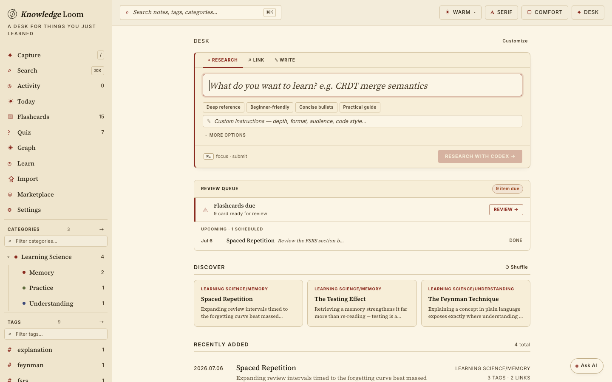
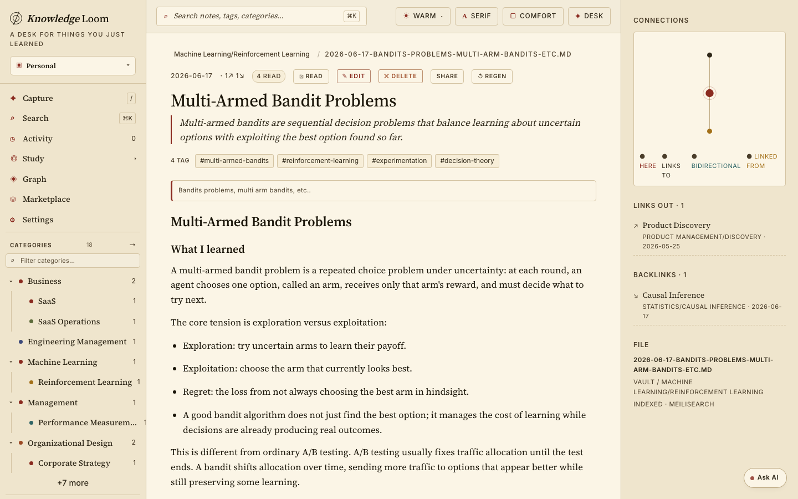
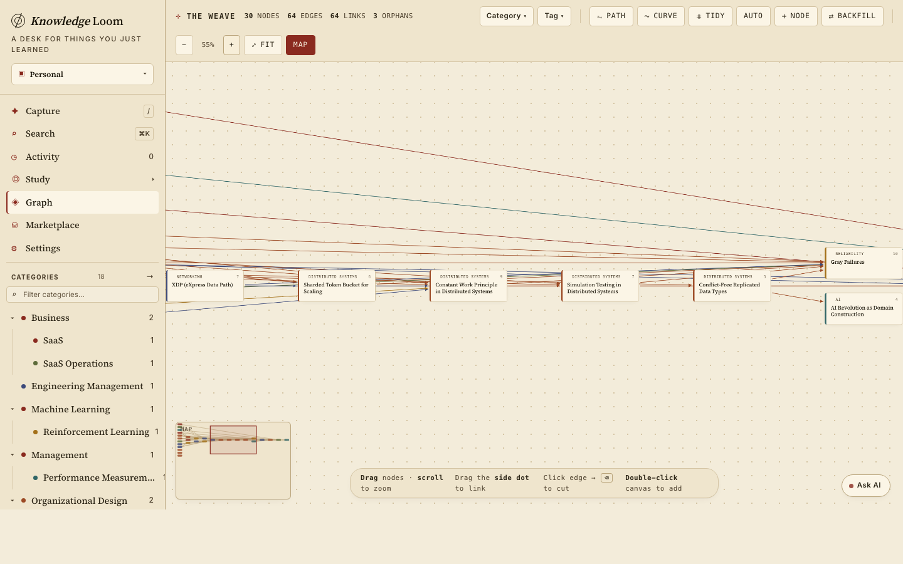
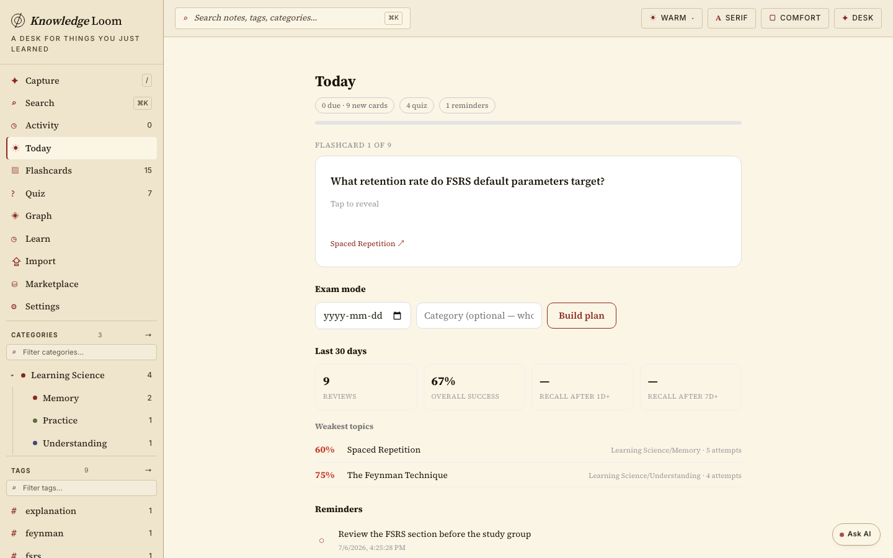
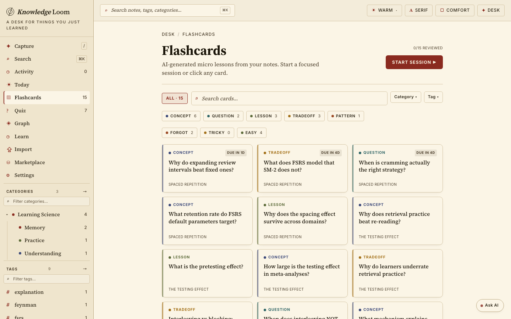
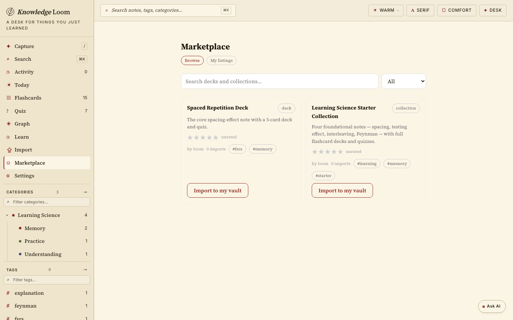

# Knowledge Loom

A second brain that makes you learn. Capture knowledge as markdown notes —
written by you, researched by AI, or imported from PDFs, lecture recordings,
photos of handwritten notes, and web pages — and Knowledge Loom turns it into
study material automatically: flashcards and quizzes on an FSRS spaced-repetition
schedule, guided learn sessions with an optional two-host podcast, a Socratic
AI tutor that cites your own notes, exam-day study plans, and retention
analytics that show what you actually remember.

## Quick start (Docker)

```bash
docker compose up -d
open http://localhost:8787
```

That's the full stack: the app (web + API in one container), Redis (job
queue), and Meilisearch (full-text search). Notes and databases persist in
Docker volumes. To unlock the AI features, pass any OpenAI-compatible key:

```bash
AI_API_KEY=sk-... AI_MODEL=anthropic/claude-sonnet-5 docker compose up -d
```

Exposing it beyond localhost? Set `AUTH_SECRET` (bearer token required on all
API calls) or front it with your own auth proxy.

## Develop locally

```bash
cp .env.example .env
docker compose -f docker-compose.dev.yml up -d   # redis + meilisearch (+ postgres)
npm install
npm run dev                                       # API :8787 + Vite :5174
```

## Stack

- **Frontend**: Vite + React + TypeScript SPA (installable PWA).
- **Backend**: NestJS (`server/src`), compiled to `server/dist`.
- **Source of truth**: markdown files under `knowledge/users/<user>/notes`
  (or any S3-compatible bucket via `NOTE_STORAGE=s3`).
- **Databases**: SQLite by default; PostgreSQL via `DATABASE_DIALECT=postgres`.
- **Queue**: BullMQ on Redis for durable AI jobs.
- **Search**: Meilisearch (default) or zero-dependency in-memory provider.
- **AI**: pluggable — the `codex` CLI locally, or any OpenAI-compatible HTTP
  API (`AI_PROVIDER=openrouter`); same pattern for transcription
  (`TRANSCRIBE_*`), vision import (`VISION_*`), and podcast TTS (`TTS_*`).

## Project shape

```text
src/                     React UI (components by feature, api client, hooks)
server/src/              NestJS modules: notes, knowledge, learn, flashcards,
                         quiz, study (Today queue/exam/stats), import, rag,
                         shares, marketplace, tts, jobs, auth, usage seams
mcp/                     Model Context Protocol server (stdio) — docs/tech/MCP.md
tests/                   unit + integration + e2e suites (see TESTING.md)
knowledge/               your data (gitignored) — notes, sqlite, search manifests
docker-compose.yml       one-command self-hosted stack
docker-compose.dev.yml   infra only, for npm run dev
Dockerfile               container image — docs/tech/SELF_HOSTING.md
```

Documentation lives in [docs/](docs/README.md):
[architecture](docs/tech/ARCHITECTURE.md),
[API reference](docs/tech/API.md), [AI spec](docs/tech/AI_SPEC.md),
[self-hosting](docs/tech/SELF_HOSTING.md), [MCP](docs/tech/MCP.md).
Contributors: [CONTRIBUTING.md](CONTRIBUTING.md) · AI agents: [AGENTS.md](AGENTS.md)

## Feature walkthrough

### Capture, and everything becomes study material

Write notes directly, let AI polish a draft, research a topic from scratch,
clip any web page (bookmarklet in Settings), or **import** PDFs, lecture
audio/video, and photos of handwritten notes. The desk shows your review
queue, reminders, and vault at a glance.



### Notes are a linked knowledge base

Markdown with categories, tags, and (bidirectional) links; every note shows
its connections, backlinks, and the file on disk it lives in — your data is
just markdown.





### Study on a real spaced-repetition schedule

Every note grows an AI-generated flashcard deck and quiz. The **Today** queue
merges everything due; **FSRS-4.5** schedules reviews; **exam mode** lays out
a day-by-day plan toward a date; retention stats show what you actually
remember after 1+ and 7+ days — and which topics are weakest.





### Share decks and import from the marketplace

Publish read-only notes or whole collections at unguessable URLs, then list
them on the marketplace: browse, search, star-rate, and import other
people's decks — imported notes arrive with flashcards and quizzes intact.



### And more

- **Spaces** — fully separate workspaces (own notes, categories, flashcards,
  progress) with a switcher at the top of the sidebar. Self-hosted instances
  are unlimited by default (`MAX_SPACES` to cap).
- **Learn sessions** — guided slide decks or a two-host podcast (with real
  TTS voices when a key is configured), XP, streaks, mastery.
- **Ask & Tutor** — RAG chat over your notes, plus a Socratic tutor that
  quizzes you and cites every claim `[Note: "…"]`.
- **MCP server** — expose the vault to Claude and other MCP clients (stdio,
  read-only by default).
- **PWA** — installable, offline shell, touch-friendly review.

## Auth & licensing

This repository is the public core, licensed under the **GNU Affero General
Public License v3.0 or later (AGPL-3.0-or-later)** — see `LICENSE`. You can
use, modify, self-host, and redistribute it freely; if you run a modified
version to offer a network service, the AGPL requires you to make that
modified source available to its users.
It runs in single-user local mode by default: no login, all data under
`userId="local"`. `AUTH_SECRET` adds bearer-token protection for exposed
instances.

Multi-user auth (Supabase), billing, quota, and the admin console live in a
private repo whose modules attach at build time through explicit seams
(`AUTH_STRATEGY`, the usage service, and the frontend extension registry).
Core code never imports `extensions/` — an ESLint rule enforces it — so the
open-source build is complete and self-contained on its own.

## Tests

```bash
npm run test:all   # unit + frontend + e2e + integration (needs redis)
npm run lint
```

See [TESTING.md](TESTING.md) for what each suite covers.

## Read-only mode

Set `KNOWLEDGE_READ_ONLY=1` to disable writes: capture and AI jobs are
rejected, mutation routes return 403, derived files and search sync are
skipped, and `/api/status` reports `{ "readOnly": true }`.
